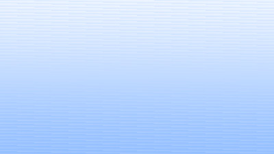
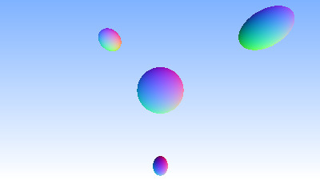
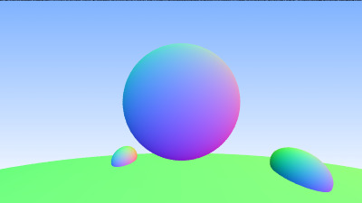

Ray Trace Weekend
=================

Following https://raytracing.github.io/books/RayTracingInOneWeekend.html
to build a ray tracer. Most of the code is very differently structured.

Some additional features here:

- Parallelize ray tracing using C++17's `par_unseq` support
- Add live preview using OpenCV for live viewing

Live preview demo:

<video src='results/13-live-preview.mp4'/>

## Incremental Results

